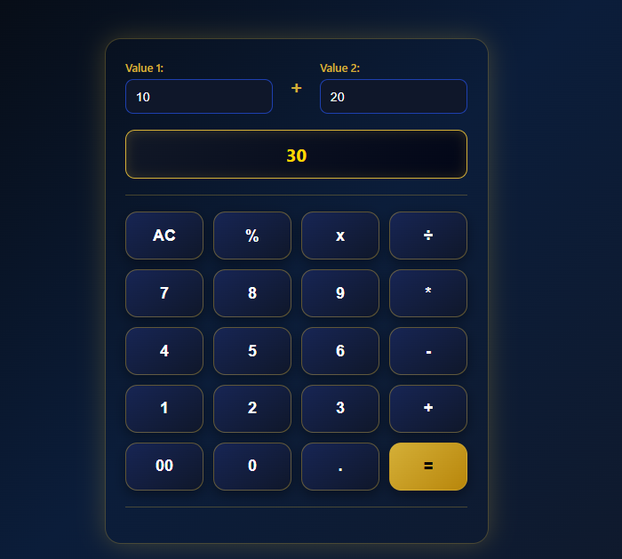

# Calculator

A simple calculator web application made using HTML, CSS and JavaScript.

## Features

- Addition
- Subtraction
- Multiplication
- Division
- Percentage calculation
- Delete button
- Reset button
- Decimal number support

## Technologies Used

- HTML
- CSS
- JavaScript

## How to Run

1. Download this repository.
2. Open `index.html` in your browser.
3. Use the calculator.
4. 
## Screenshot

